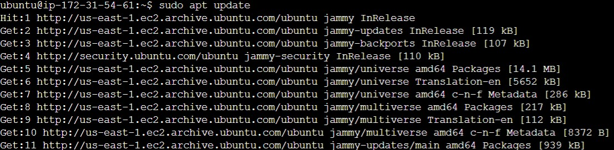
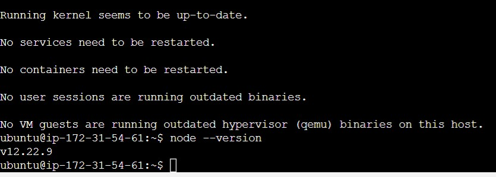
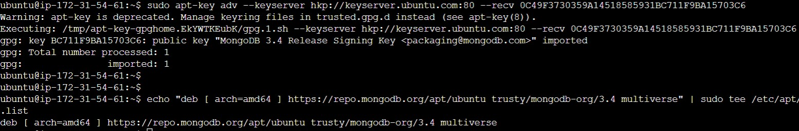

## THIS IS A MEAN STACK DEPLOYMENT TO UBUNTU IN AWS 

In this project, I implemented a simple Book Register web form using MEAN stack.    

### Step 1: Install NodeJs  
`Node.js` is a JavaScript runtime built on Chrome’s V8 JavaScript engine. Node.js is used in this tutorial to set up the Express routes and AngularJS controllers.  

To update my ubuntu     
`sudo apt update`   
        

Then upgrade Ubuntu     
`sudo apt upgrade`   and pick the yes option to ensure all package download     

Install NodeJs      
`sudo apt install -y nodejs`  afterwhich I used `node --version` to check the installed version     
           

### Step 2: Install MongoDB 

MongoDB stores data in flexible, `JSON-like` documents. Fields in a database can vary from document to document and data structure can be changed over time. For this example application, I added book records to MongoDB that contain book name, isbn number, author, and number of pages.
mages/WebConsole.gif        
`sudo apt-key adv --keyserver hkp://keyserver.ubuntu.com:80 --recv 0C49F3730359A14518585931BC711F9BA15703C6`        

`echo "deb [ arch=amd64 ] https://repo.mongodb.org/apt/ubuntu trusty/mongodb-org/3.4 multiverse" | sudo tee /etc/apt/sources.list.d/mongodb-org-3.4.list`       
          

### Install MongoDB     
`sudo apt install -y mongodb`   

