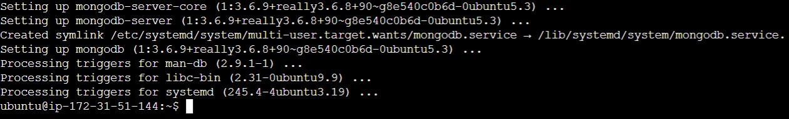
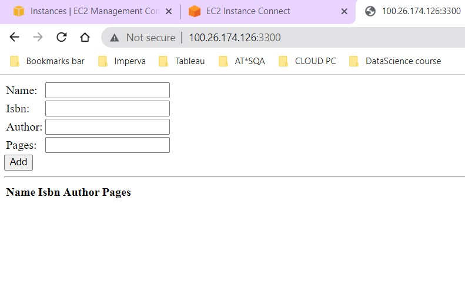

## THIS IS A MEAN STACK DEPLOYMENT TO UBUNTU IN AWS 

In this project, I implemented a simple Book Register web form using MEAN stack.    

### Step 1: Install NodeJs  
`Node.js` is a JavaScript runtime built on Chrome’s V8 JavaScript engine. Node.js is used in this tutorial to set up the Express routes and AngularJS controllers.  

To update my ubuntu     
`sudo apt update`   
        

Then upgrade Ubuntu     
`sudo apt upgrade`   and pick the yes option to ensure all package download     

Install NodeJs      
`sudo apt install -y nodejs`  afterwhich I used `node --version` to check the installed version     
           

### Step 2: Install MongoDB 

MongoDB stores data in flexible, `JSON-like` documents. Fields in a database can vary from document to document and data structure can be changed over time. For this example application, I added book records to MongoDB that contain book name, isbn number, author, and number of pages.
mages/WebConsole.gif        
`sudo apt-key adv --keyserver hkp://keyserver.ubuntu.com:80 --recv 0C49F3730359A14518585931BC711F9BA15703C6`        

`echo "deb [ arch=amd64 ] https://repo.mongodb.org/apt/ubuntu trusty/mongodb-org/3.4 multiverse" | sudo tee /etc/apt/sources.list.d/mongodb-org-3.4.list`       
          

### Install MongoDB     
`sudo apt install -y mongodb` 
   

Then started the server     
`sudo service mongodb start`        

To verify that the service is up and running    
`sudo systemctl status mongodb`     
    

Then installed npm – **Node package manager.**      
`sudo apt install -y npm`       

**Next is to Install *body-parser* package**        
‘body-parser’ package is to help us process **JSON** files passed in requests to the server.        
`sudo npm install body-parser`  

Then created a folder named ‘Books’     
`mkdir Books && cd Books`       

In the Books directory, I Initialized *npm* project
`npm init`      

Added a file to it named *server.js*    
     

vi into the server.js file  
`vi server.js`      

Then copied and pasted the web server code below into the server.js file.     
        

### Step 3: Install Express and set up routes to the server ###     
Express is a minimal and flexible Node.js web application framework that provides features for web and mobile applications. We will use Express in to pass book information to and from our MongoDB database.

I also used Mongoose package which provides a straight-forward, schema-based solution to model your application data. We will use Mongoose to establish a schema for the database to store data of our book register.      

`sudo npm install express mongoose`     

In ‘Books’ folder, I created a folder named apps   
`mkdir apps && cd apps`     

Created a file named routes.js  
`vi routes.js`      
paste the below lines in it and save.   
        

In the ‘apps’ folder, create a folder named models
`mkdir models && cd models`     

Create a file named book.js 
`vi book.js`        

      

### Step 4 – Access the routes with AngularJS ###       

AngularJS provides a web framework for creating dynamic views in web applications. I used AngularJS to connect my web page with Express and perform actions on the book register.

At changing the directory back to ‘Books’       
cd ../..        

Created a folder named public   
`mkdir public && cd public`

Copy and paste the Code below (controller configuration defined) into the script.js file.
Add a file named script.js `vi script.js`       
      

In public folder, created a file named index.html;  `vi index.html`     
Copy and paste the code below into index.html file. 
       

Cd back to books - ` cd ..`    

 Started the server by running this command:    
`node server.js`

The server is now up and running, we can connect it via port 3300. Launched a separate SSH console to test what curl command returns locally and also used my browser to display a readable format.  

   

Quick reminder how to get your server’s Public IP and public DNS name:

You can find it in your AWS web console in EC2 details
Run curl -s http://169.254.169.254/latest/meta-data/public-ipv4 for Public IP address or curl -s http://169.254.169.254/latest/meta-data/public-hostname for Public DNS name.
This is how your Web Book Register Application will look like in browser:

`curl -s http://localhost:3300` with my public IP applied as been set up on my AWS security group on port 3300.     
 

## PBL Progressive’ projects is now Completed!!    

